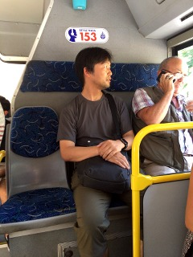

# HARA Kojiro のウェブサイト

## About
氏名：原　光二郎（はら　こうじろう）
所属：生物生産科学科 [植物資源創成システムグループ](http://www.lichen.akita-pu.ac.jp/index.shtml)
職名：准教授
学位：博士（バイオサイエンス）

---

## Contact
〒010-0195
秋田市下新城中野字街道端西241-438
秋田県立大学　生物資源科学部

e-mail: kojiro_h☕️akita-pu.ac.jp
（上記の ☕️ を「@」に置き換えて下さい）

---

## Links
+ [生物生産科学科 教員ページ](https://www.dbp.akita-pu.ac.jp/~hara/index.html)
+ [Researchmap](http://researchmap.jp/kojiro_h/)
+ [ResearchGate](https://www.researchgate.net/profile/Kojiro_Hara)
+ [ORCID](https://orcid.org/0000-0002-5423-2419)

---

:::footer
updated: 2026-08-11T22:33:30
:::

